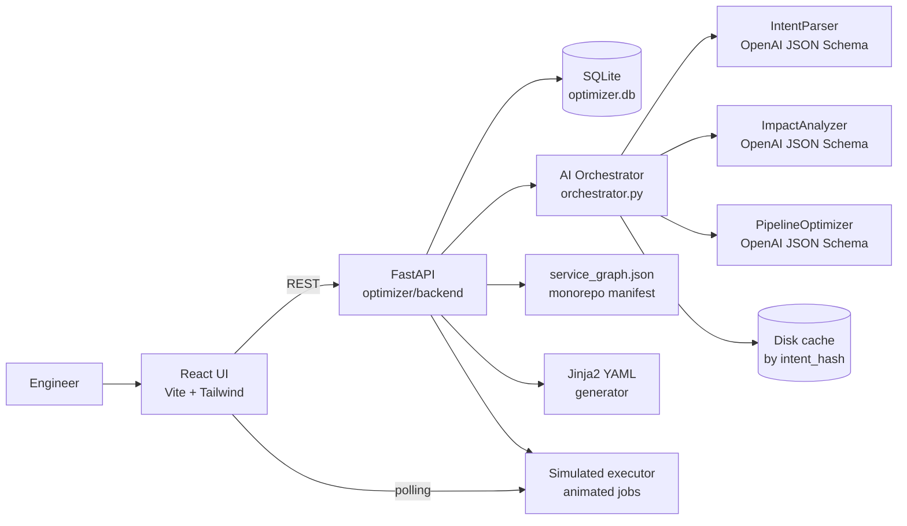

# Intent-Aware CI/CD Optimizer — Master Execution Plan

This is the commander plan. Backend, frontend, and AI engineers each have their own plan that follows the contracts here. Read this first.

## Locked Decisions

- Pivot strategy: rip out [rosruc/backend](rosruc/backend) (Node/Express, wrong product). Keep [rosruc/frontend](rosruc/frontend) shell only — rewrite components for the new product. New code lives under `optimizer/` at repo root.
- Stack:
  - Backend: Python 3.11, FastAPI, Uvicorn, SQLAlchemy, SQLite (single file `optimizer.db`), Jinja2 (YAML templates).
  - Frontend: Vite + React 18 + TypeScript + Tailwind + Zustand + react-flow (graph viz) + recharts (savings charts).
  - AI: OpenAI Structured Outputs (`response_format: json_schema`). Sequential agents. NO LangGraph for 16h MVP — overkill.
- Demo monorepo: a fake fintech monorepo committed under `optimizer/demo/monorepo/` with 8 services and a hand-written `service_graph.json`. No real compilation, ever.
- Compute pricing constant: hardcoded `$0.12/min` ($7.20/hr) per CI minute (close to GitHub-hosted large-runner pricing — defensible).

## System Architecture



## What is REAL / MOCKED / SIMULATED

- REAL (write actual code):
  - FastAPI server, SQLite persistence, all REST endpoints.
  - React UI, all views, react-flow graph, recharts dashboards, approval modal.
  - OpenAI calls with structured JSON outputs.
  - Jinja2-templated GitHub Actions YAML output (validated parseable, not runnable).
  - Savings math (time/$ delta from baseline manifest values).
- MOCKED (no third-party integration):
  - Jira ingest = paste ticket text in UI or pick from `optimizer/demo/intents/*.json` fixtures.
  - GitHub PR ingest = paste PR title/body + diff, or pick from `optimizer/demo/prs/*.json` fixtures.
  - Monorepo = `optimizer/demo/monorepo/` with stub files only. No real builds.
- SIMULATED (looks live, isn't):
  - GitHub Actions execution = animated progress bars driven by baseline build times in `service_graph.json`. Job states transition queued → running → success/skipped on a timer.
- HARDCODED SAFELY:
  - Per-service baseline build/test times in the manifest.
  - Aggregate "saved this week" counter seeded with believable numbers (e.g. 47.3h / $189.12) and ticks up on every run.
  - Disk-cached LLM response per demo intent (every demo path works offline).

## Feature Prioritization (Ruthless)

MUST HAVE — no demo without these:
- Intent inbox: pick a Jira ticket fixture and a linked PR fixture.
- AI analyze button → IntentParser → ImpactAnalyzer → PipelineOptimizer pipeline returning structured JSON.
- Impact view: react-flow graph with impacted services lit, irrelevant services grayed.
- Plan diff card: "Full pipeline: 28m / $3.36" vs "Optimized: 11m / $1.32" — saves 17m / $2.04.
- Generated YAML viewer (read-only `<pre>` with syntax highlighting).
- Approval modal: "I can safely skip 4 service builds + 12 test suites. Approve?"
- Animated execution dashboard: jobs run to green, skipped jobs flash "SKIPPED — saved Xm".

SHOULD HAVE — strongly improves demo:
- Three demo intents covering distinct narratives (small fix, cross-service refactor, infra-only).
- Confidence score per AI step (visible in UI). Auto-approve when confidence ≥ 0.85, else require human click.
- Aggregate "saved this week" counter on dashboard, with recharts sparkline.
- Streaming "AI is thinking…" indicator (Server-Sent Events or polled status).

NICE TO HAVE — only if H10+ buffer:
- Embedding-based fuzzy service matching as fallback when intent text doesn't match a service name directly.
- Audit log panel (decisions over time).
- Dark mode.

DO NOT BUILD — explicit kill list:
- Real GitHub/Jira OAuth.
- Real CI runner, Docker execution, sandbox.
- Real static analysis / AST / dependency graph extraction.
- Multi-repo, multi-tenant, user auth, RBAC.
- Unit tests (the demo IS the test). Manual smoke only.
- Database migrations beyond `init_db()`.
- LangGraph, Celery, Redis, message queues, websockets (use polling).

## 16-Hour Timeline

H0–H2 — Foundations + Contracts (full parallel)
- All three: 30 min sync to lock JSON schemas (intent, impact, plan, execution) and demo monorepo structure. The schemas are THE contract — get them right, then everyone codes against fixtures.
- Backend: scaffold FastAPI, SQLite, healthcheck, fixture-loading endpoints.
- Frontend: scaffold Vite, Tailwind, routing skeleton, hit `/health`.
- AI: write prompts, JSON schemas, hand-craft cached fixture responses for offline mode.
- Checkpoint H2: contracts frozen, every service can boot.

H2–H4 — Vertical Slice on Stubs
- Backend: `/intents`, `/intents/{id}/analyze` returning fixture JSON. No AI yet.
- Frontend: full happy path renders off fixture data — inbox → impact → plan → execution.
- AI: structured-output prompts working in isolation against OpenAI; cached.
- Checkpoint H4: full demo runs end-to-end on stubs. This is the safety net.

H4–H8 — Real AI + Real Optimization
- AI: orchestrator wired into backend; cache-on-miss strategy live.
- Backend: real impact analysis (manifest lookup + AI fuzz), real YAML generation, real savings math.
- Frontend: react-flow graph populated from real impact response.
- Checkpoint H8: at least 1 of 3 demo intents flows end-to-end with real AI.

H8–H12 — Polish + Animation (the hackathon-winning hours)
- Animated execution dashboard. This single component creates more wow than anything else — invest here.
- Aggregate savings counter ticking up live.
- All 3 demo intents wired.
- Approval modal with confidence-driven UX.
- Checkpoint H12: full demo runs cleanly twice in a row.

H12–H14 — Integration + Rehearsal
- 3 clean dry runs of the demo flow.
- Cache every LLM response observed during rehearsal.
- Bug squash.

H14–H15 — Buffer.

H15–H16 — DEMO FREEZE.
- Zero code changes. Rehearsal only. Two laptops with the demo loaded.

## Demo Flow — 90 Seconds Live

1. Hook (10s): open dashboard. Aggregate counter shows "47.3 hours / $189.12 saved this sprint." Frame: every CI pipeline burns compute on tests that don't matter.
2. Intent ingest (15s): click ticket "Update payment retry logic." Click linked PR. Show 4 changed files under `services/payments/`.
3. AI analysis (20s): click Analyze. Watch streaming output — intent matched to `payments`; dependents `notifications`, `ledger` flagged; `frontend-web`, `frontend-mobile`, `auth`, `ml-recommender` recommended for skip.
4. Plan diff (15s): graph lights 4 services, grays 4. Card: "Skip 4 builds + 12 test suites. Save 17m 22s and $2.14."
5. Approval (5s): click Approve & Run.
6. Execution (20s): 4 jobs animate to green, 4 jobs flash SKIPPED with savings tally. Side panel shows generated YAML.
7. Close (5s): "Per pipeline, small. At Stripe-scale CI volume, this is millions a year."

## Pitch

Elevator (15s):
> Every CI pipeline runs every test on every commit. Most of that compute is waste. We built an intent-aware execution engine that reads your PM ticket and PR diff, figures out what actually changed, and surgically runs only what matters. 60% compute reduction and 40% wall-clock reduction in our demo monorepo.

Technical positioning (60s):
- We sit between source control and the CI runner — a thin intelligence layer over GitHub Actions.
- AI agents read engineering intent (PM ticket + PR diff) and produce a structured optimization plan.
- We don't replace your CI — we prune it.
- vs Bazel/Nx/Turborepo: those need a build graph and high config investment. We work zero-config from intent + heuristics + LLM reasoning, sharpening with embeddings as we learn the repo.
- vs CircleCI/GitHub Actions: they execute pipelines. We decide which pipelines should execute.
- Pricing hook: any team running 100+ CI minutes/day has a quantifiable burn rate we can quote in dollars on day one.

## Risk Reduction

Highest-impact risks and the kill switches:
- API rate limits or stage WiFi failure → every demo intent has a pre-cached LLM response on disk keyed by `sha256(intent_text + diff)`. Cache hit is silent and indistinguishable from a live call.
- Frontend graph rabbit hole → use react-flow with manual layout. Do not touch d3 force-directed.
- YAML correctness rabbit hole → render via Jinja2, validate with `yaml.safe_load`. Do not attempt to make it runnable on a real GitHub Actions runner.
- Demo monorepo bloat → cap at 8 services, 5–10 stub files each, no real package.json install scripts.
- Cross-team integration debt → freeze contracts at H2 and only edit by group consensus.

Cut order if behind schedule (cut from bottom):
1. Embedding-based fuzzy matching.
2. Dark mode.
3. Streaming AI thinking indicator (replace with simple spinner + 1.5s artificial delay).
4. Audit log.
5. Drop from 3 demo intents to 2.
6. Drop confidence-driven auto-approve, always require manual approval.

## What Judges Actually Care About

- Looks like a real product: animations, savings counter, polished modal.
- AI is visibly doing something: show the streaming structured-JSON output for 2 seconds during the demo.
- Numbers feel earned: anchor them to baseline build times in the visible manifest. The math is on screen.
- Solves a felt pain: every dev judge has watched 30-minute CI for a one-line change.

## Shared JSON Contracts (frozen at H2)

These are the single source of truth across all three role plans.

Intent record (`intents` table + API):
```json
{
  "id": "INT-101",
  "source": "jira",
  "ticket_id": "PAY-482",
  "title": "Update payment retry logic",
  "body": "Customers see double-charges when retry fires within 200ms ...",
  "pr_id": "PR-2031",
  "pr_title": "fix(payments): debounce retry within 250ms window",
  "pr_diff_files": ["services/payments/retry.py", "services/payments/tests/test_retry.py"]
}
```

Impact analysis (AI output → API → UI):
```json
{
  "intent_id": "INT-101",
  "primary_services": ["payments"],
  "dependent_services": ["notifications", "ledger"],
  "skipped_services": ["auth", "frontend-web", "frontend-mobile", "ml-recommender"],
  "skipped_test_suites": ["frontend.unit", "frontend.e2e", "auth.integration", "ml.smoke"],
  "confidence": 0.91,
  "rationale": "Diff scoped to services/payments/. Manifest declares notifications and ledger consume payments via events. No frontend or auth surface touched."
}
```

Optimization plan (savings + YAML):
```json
{
  "intent_id": "INT-101",
  "baseline_minutes": 28.0,
  "optimized_minutes": 10.6,
  "minutes_saved": 17.4,
  "dollars_saved": 2.09,
  "yaml": "name: optimized-ci\non: [pull_request]\n..."
}
```

Execution event (animated dashboard):
```json
{
  "plan_id": "PLAN-101",
  "job_id": "payments.test",
  "service": "payments",
  "kind": "test",
  "status": "running",
  "started_at": "2026-05-22T18:32:14Z",
  "duration_seconds_estimated": 84,
  "skipped_reason": null
}
```

## Repo Mapping Strategy (lightweight)

We do NOT build static analysis. We use a 3-layer hybrid:

1. Manifest first (deterministic). `service_graph.json` declares each service: paths owned, tests owned, dependents, baseline build/test times. Diff path → service is a string-prefix match.
2. AI second (fuzzy). When intent text mentions concepts not directly in path (e.g. "retry logic" but no `retry/` folder), the ImpactAnalyzer agent uses the manifest as context and infers the closest service.
3. Embeddings third (only if H10+ buffer). Pre-embed each service description; cosine-match intent text. Adds robustness for ambiguous intents but not required for demo.

Example `service_graph.json` entry (one of 8):
```json
{
  "name": "payments",
  "description": "Handles charge, refund, retry, and reconciliation flows.",
  "paths": ["services/payments/"],
  "test_suites": ["payments.unit", "payments.integration"],
  "depends_on": ["ledger"],
  "consumed_by": ["notifications", "ledger"],
  "baseline_build_seconds": 95,
  "baseline_test_seconds": 220,
  "dockerfile": "services/payments/Dockerfile"
}
```

8 services planned: `payments`, `auth`, `notifications`, `ledger`, `ml-recommender`, `frontend-web`, `frontend-mobile`, `infra`.

## Final Build Order (do these literally in this sequence)

1. H0:00–H0:30 — three-person sync. Lock contracts above. No exceptions.
2. H0:30–H1:30 — hand-write `service_graph.json` + 3 intent fixtures + 3 PR fixtures. This single file determines impact analysis quality.
3. H1:30–H2:00 — backend stub returns fixture data; frontend renders something.
4. H2–H4 — entire happy path renders off fixtures. You have a working "demo" before any real AI.
5. H4–H8 — replace stubs with real AI and real YAML.
6. H8–H12 — animations, polish, multiple intents.
7. H12+ — rehearse, cache, freeze.

The single most leveraged hour is H8–H10: the execution dashboard animation. Allocate your best UI engineer to it and protect the time.